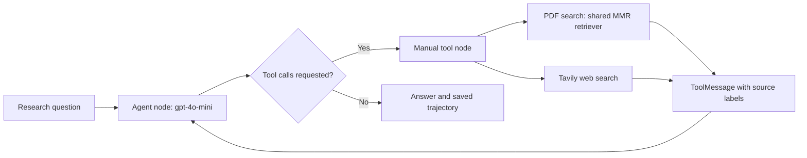

# Project III — Market Competitor Intelligence Research Agent

**William Matthew Tyler · `billiammtyler-lgtm` · AI-assisted project portfolio**

A manual LangGraph research agent combines filing retrieval and live web search,
produces a Tesla competitive intelligence report, and is compared with a naive
PDF RAG baseline on 24 questions. This portfolio shows the implementation,
measured results, source-audited report and concrete failure analysis from the
October 5, 2026 run.

**Explore the work:** [High-code notebook](notebooks/William_Matthew_Tyler_Project_III_High.ipynb)
· [Low-code notebook](notebooks/William_Matthew_Tyler_Project_III_Low.ipynb)
· [reviewed report](reports/Tesla_market_report_2026-10-05_reviewed.md)
· [evaluation analysis](evaluation/evaluation_analysis.md)
· [48 recorded answers](evaluation/evaluation_results.csv)
· [implementation source](src/William_Matthew_Tyler_Project_III_Low.py)

The project demonstrates tool design and routing, PDF ingestion, semantic
retrieval, manual graph control, structured model evaluation, durable checkpoint
recovery, citation auditing and evidence-based failure diagnosis. Both notebooks
also have [High-code HTML](notebooks/William_Matthew_Tyler_Project_III_High.html)
and [Low-code HTML](notebooks/William_Matthew_Tyler_Project_III_Low.html) exports
for download and browser viewing.

## Architecture



`agent_node`, `tool_node` and `route_after_agent` are explicitly implemented.
The graph is assembled with `StateGraph`, conditional routing and an agent/tool
loop; it does not use a prebuilt ReAct agent or `ToolNode`. Tool responses retain
their call IDs through `ToolMessage`, and bounded recursion prevents endless
research loops.

- **Shared PDF pipeline:** five course-provided PDFs, 1,275 chunks, 2,000-character
  chunks with 200-character overlap, document/period headers and one-based page
  labels. `text-embedding-3-small` supplies 1,536-dimensional embeddings in
  batches of 200; an `InMemoryVectorStore` retrieves by MMR (`k=6`, `fetch_k=20`).
- **Research agent:** `gpt-4o-mini` chooses between `pdf_search_tool` and
  `tavily_web_search_tool`, can refine searches, and produces a seven-section report.
- **Baseline:** the same corpus, retriever and generation model, with exactly
  one PDF retrieval and one plain model call per question.
- **Evaluation:** deterministic answer/tool/evidence checks plus a separate
  structured `gpt-4o` correctness judge. Reference answers are evaluation inputs
  only and never enter either system's answer-generation context.
- **Recovery:** atomic per-role checkpoints, a configuration/prompt/corpus/code
  fingerprint, separate runtime and judge statuses, and an optional exact-corpus
  embedding cache.

## Measured results

| Outcome on 24 questions per system | Research agent | Naive PDF RAG |
| --- | ---: | ---: |
| Deterministic passes | 11/24 (45.8%) | 10/24 (41.7%) |
| Mean judge score | 0.7500 | 0.5625 |
| Mean generation latency | 5.72 s | 1.96 s |
| Mean tool calls | 1.54 | 1.00 |
| PDF factual passes | 5/12 | 7/12 |
| Web-current passes | 3/3 | 0/3 |
| Hybrid passes | 2/3 | 0/3 |

All 48 answer records and 48 judge verdicts completed. Deterministic checks and
the scored judge agreed on 40/48 answers (83.3%). Latency measures per-question
generation for this run, excluding ingestion and judging; analyst effort, ROI
and production throughput were not measured. These are educational benchmark
outcomes, not a general accuracy claim.

The agent broadened source coverage, but the baseline performed better on the
PDF-only factual subset. The recorded failures explain why:

- A quarterly free-cash-flow answer used a **TTM** figure; an energy-storage
  answer used a **first-half cumulative** quantity as a quarterly quantity.
- A segment gross-profit table was missed, producing an unnecessary refusal.
- A report citation changed a valid 10-Q filename into an Update-deck filename
  with an impossible page number. Correct retrieval labels did not guarantee
  correct final citations.
- Strict file/spacing checks rejected a valid gross-margin answer; the model
  judge also made reasoning and news-date mistakes. Neither evaluator replaces
  claim-level source verification.

See the [retrieval diagnosis](evaluation/retrieval_diagnosis.md),
[saved failures](evaluation/failure_analysis.md) and
[judge disagreements](evaluation/judge_scored_disagreements.csv).

## Reports and run provenance

The [original generated report](reports/Tesla_market_report_2026-10-05_original_generated.md)
is retained as observed model output. Its period, figure and citation errors
remain visible. The [separately reviewed report](reports/Tesla_market_report_2026-10-05_reviewed.md)
was corrected through AI-assisted auditing against supplied document pages and
identified primary web sources. It did **not** alter benchmark model answers or
improve their recorded scores. [Report audit](reports/report_audit.md) documents
the corrections and source limitations.

**One canonical local run was performed.** The completed Low-code course
notebook ran in Python 3.12. High-code has the same 47 implementation code cells
and shared the genuine canonical outputs. These are two presentation variants,
not independent experiments. One transient authentication failure was retried;
the other 47 completed answer roles and 47 judge verdicts were reused. Successful
wrong answers were not rerun or silently repaired. The
[canonical provenance](evidence/live_output_provenance.json) and
[retry provenance](evidence/generation_retry_provenance.json) record this.

This **public edition** removes course teaching text/logos, private links,
personal machine paths, all recorded notebook cell outputs, supplied reference
answers and raw retrieval payloads. The notebooks retain every implementation
code cell unchanged and append curated results, reflections and the audited
report as Markdown. Curated trajectories preserve model answers, tool arguments,
source labels and context hashes; they are not resumable checkpoints. The
[public-edition manifest](evidence/public_edition_manifest.json) records the
structural changes and original/public code hash. The original local submission
artifacts were not modified.

## Reproduce or inspect

For **offline inspection**, download the HTML exports, read the code and reports,
or install `nbformat` and run:

```console
python scripts/validate_portfolio.py
```

The validator makes no API calls. It checks notebook schemas, identical code
sources, recorded answer/verdict counts, metrics, cleared outputs and common
credential/private-path patterns.

For **a fresh live run**, use Python 3.12, install `requirements.txt`, obtain
authorized access to the five PDFs and evaluation CSV listed in
[data/README.md](data/README.md), and supply your own OpenAI-compatible and Tavily
credentials. `requirements.txt` is the frozen measured-run environment, not a
claim that every platform/version combination was tested.

The code supports environment variables `OPENAI_API_KEY`, `OPENAI_BASE_URL`,
`TAVILY_API_KEY`, and `PROJECT3_DATA` (absolute path to the resource directory).
Alternatively, copy `config.example.json` to an ignored private `config.json`
and set `PROJECT3_CONFIG` to its absolute path. The example uses the course
gateway; change the base URL if your authorized provider is different. The
required model identifiers are `gpt-4o-mini`, `gpt-4o` and
`text-embedding-3-small`.

Open either notebook in a Python notebook environment, or run its exported
Python source from a separate ignored working directory such as `runs/local/`.
The complete script performs ingestion, live examples, report generation and
the evaluation. Optional `PROJECT3_VECTOR_CACHE` points to a private embedding
cache. Fresh runs consume API credits and may produce different web results or
model responses; the research date is computed at runtime while the corpus's
filing period remains Q2 2026.

Full benchmark reproduction requires the private evaluation CSV; this public
repository intentionally does not provide its reference answers. Public issuer
and IEA resources are identified by filename/source role, and report links point
to cited web sources. Source audits validate the supplied corpus's contents;
they do not independently authenticate every course-provided PDF. This is a
dated educational research sample, not investment advice or a live data product.

## Attribution and assistance

This is William Matthew Tyler's Great Learning Project III portfolio submission.
Great Learning supplied the Low-code template, project scenario, assessment
constraints and evaluation design. The implementation and project artifacts
were completed with **Codex/OpenAI AI assistance**, including code generation,
execution support, analysis and source auditing. The repository shows the work
and its evidence without claiming unaided manual authorship or unperformed
independent human review. Prompts are available in [prompts/](prompts/).
Small deterministic-check and judge-test examples in the implementation also
originate from the course assessment, alongside the added recovery/audit code.

Third-party source documents remain with their respective issuers/providers and
are not redistributed here. No API keys, source PDFs, evaluation reference CSV,
private cloud notebooks or embedding cache are included.
